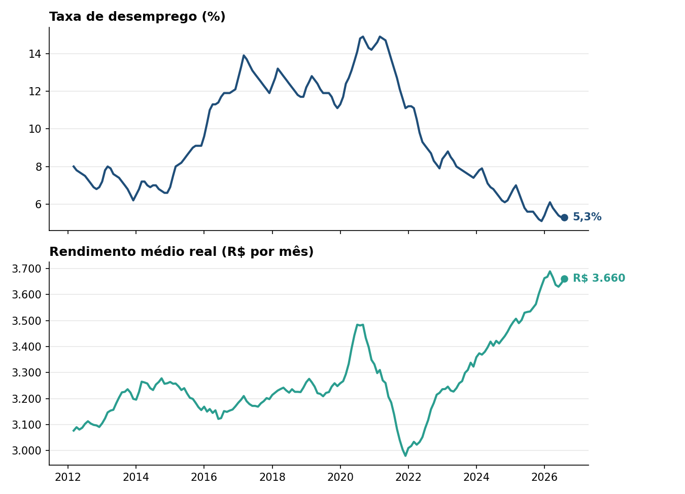

```{python}
# Os textos e numeros vem de resumo.json (passo 3); o grafico, de mercado_trabalho.csv.
import csv
import json
import os
from datetime import datetime
from pathlib import Path

import matplotlib
import matplotlib.pyplot as plt

PASTA = Path(os.environ.get("PASTA_DADOS", "."))
r = json.loads((PASTA / "resumo.json").read_text(encoding="utf-8"))
mes_ref, tri_ref, inicio, chegada = r["mes_ref"], r["tri_ref"], r["inicio"], r["chegada"]
desemp_ult, desemp_1m, desemp_12m = r["desemp_ult"], r["desemp_1m"], r["desemp_12m"]
rend_ult, rend_1m, rend_12m = r["rend_ult"], r["rend_1m"], r["rend_12m"]

with open(PASTA / "mercado_trabalho.csv", encoding="utf-8-sig") as f:
    linhas = list(csv.DictReader(f, delimiter=";"))
datas = [datetime.strptime(l["data"], "%Y-%m-%d") for l in linhas]
desemp = [float(l["taxa_desemprego"]) for l in linhas]
rend = [float(l["rendimento_medio_real"]) for l in linhas]


def br(x, casas):
    return f"{x:,.{casas}f}".replace(",", "X").replace(".", ",").replace("X", ".")
```

## Resultado de `{python} mes_ref`

**Dados divulgados pelo IBGE e obtidos no Banco Central em `{python} chegada`.**

::: {.callout-note appearance="simple"}
## Desemprego: `{python} desemp_ult`%

Em relação ao mês anterior, `{python} desemp_1m`.
Em relação a doze meses atrás, `{python} desemp_12m`.
:::

::: {.callout-note appearance="simple"}
## Rendimento médio: R$ `{python} rend_ult` por mês

Em relação ao mês anterior, `{python} rend_1m`.
Em relação a doze meses atrás, `{python} rend_12m`.
:::

## O que esses números medem

A **taxa de desemprego** é a parcela das pessoas que procuraram trabalho e não encontraram, entre todas as que estão trabalhando ou procurando trabalho. Quem não procura emprego, como estudantes que só estudam ou aposentados, fica fora da conta.

O **rendimento médio real** é quanto, em média, uma pessoa que trabalha ganha por mês com todos os seus trabalhos. A palavra "real" quer dizer que a inflação já foi descontada: os valores de meses antigos estão corrigidos para o poder de compra de hoje, e por isso dá para comparar épocas diferentes.

Os dois números vêm da PNAD Contínua, a pesquisa do IBGE que entrevista famílias em todo o país. O resultado de `{python} mes_ref` é a média dos três meses de `{python} tri_ref`. Por isso a mudança de um mês para o outro costuma ser pequena.

## Como os números evoluíram desde `{python} inicio`

```{python}
fig, (ax1, ax2) = plt.subplots(2, 1, figsize=(9, 6.5), dpi=150, sharex=True)
for ax, valores, cor, titulo, rotulo in [
    (ax1, desemp, "#1f4e79", "Taxa de desemprego (%)", f"{desemp_ult}%"),
    (ax2, rend, "#2a9d8f", "Rendimento médio real (R$ por mês)", f"R$ {rend_ult}"),
]:
    ax.plot(datas, valores, color=cor, linewidth=2)
    ax.scatter([datas[-1]], [valores[-1]], color=cor, zorder=3)
    ax.annotate(rotulo, (datas[-1], valores[-1]), xytext=(8, 0),
                textcoords="offset points", va="center", color=cor, fontweight="bold")
    ax.set_title(titulo, loc="left", fontsize=12, fontweight="bold")
    ax.grid(axis="y", alpha=0.3)
    ax.yaxis.set_major_formatter(matplotlib.ticker.FuncFormatter(lambda v, _: br(v, 0)))
    for lado in ("top", "right"):
        ax.spines[lado].set_visible(False)
fig.tight_layout(rect=(0, 0, 0.93, 1))
fig.savefig("grafico_relatorio.png")
plt.close(fig)
```

{width=100%}

Fonte: IBGE, PNAD Contínua, obtida no Sistema Gerenciador de Séries Temporais (SGS) do Banco Central, séries 24369 e 24382.
